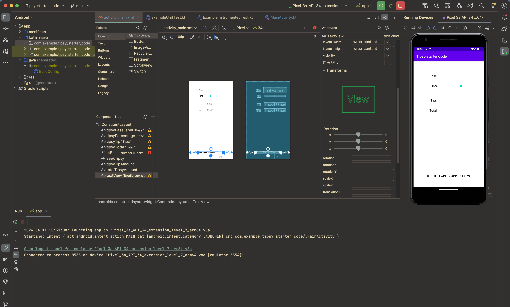
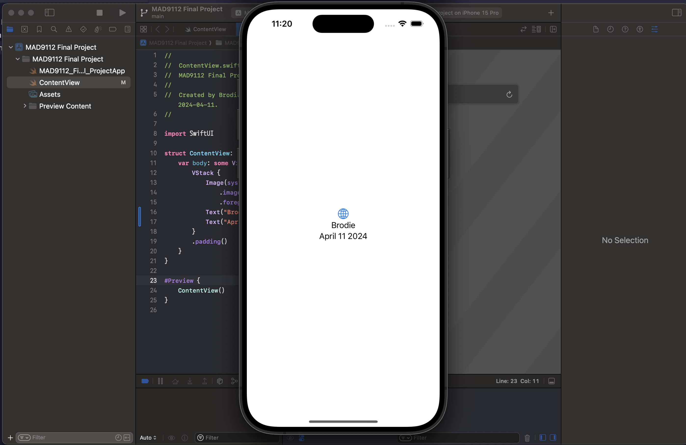
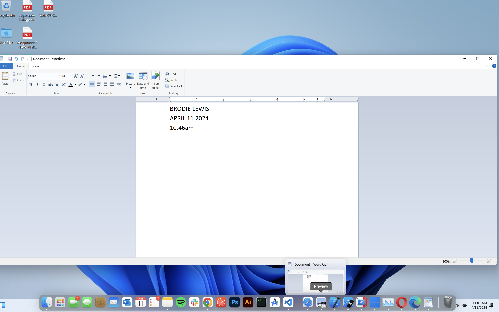

# Brodie Lewis 040 734 911

```
//weight is in kilograms
//heigh is in meters
function calculateBMI(weight = 0, height = 0) {
  let BMI = (weight * height) / weight;
  console.log(BMI);
  return BMI;
}

calculateBMI(90, 1.91);

function interpretBMI(BMI) {
  if (BMI < 18.5) {
    console.log("UnderWeight");
  } else if (BMI >= 18.5 && BMI < 25) {
    console.log("Normal Weight");
  } else if (BMI >= 25 && BMI < 30) {
    console.log("Overweight");
  } else {
    console.log("Obese");
  }
}
let adeshWeight = 90;
let adeshHeight = 1.91;

calculateBMI(90, 1.91);
interpretBMI(24.67);

```






